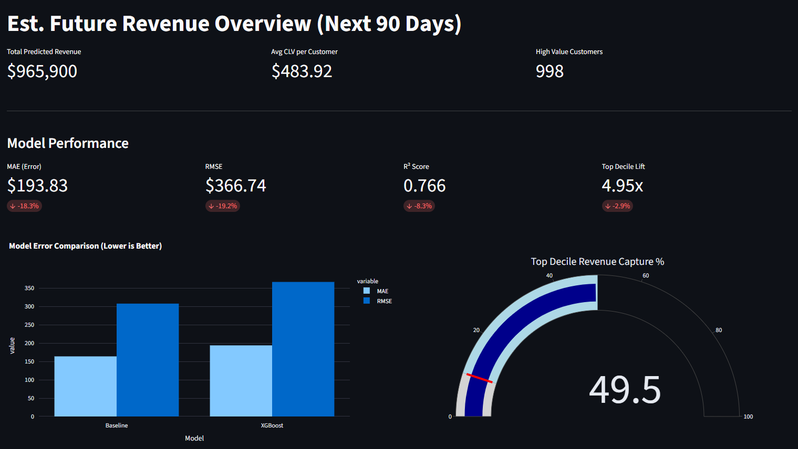
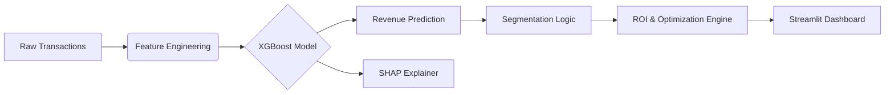
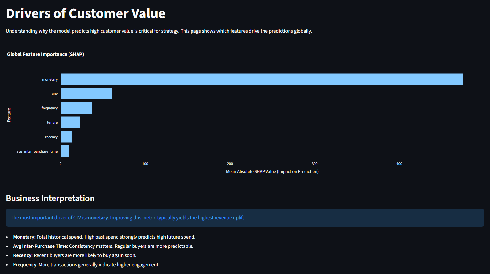
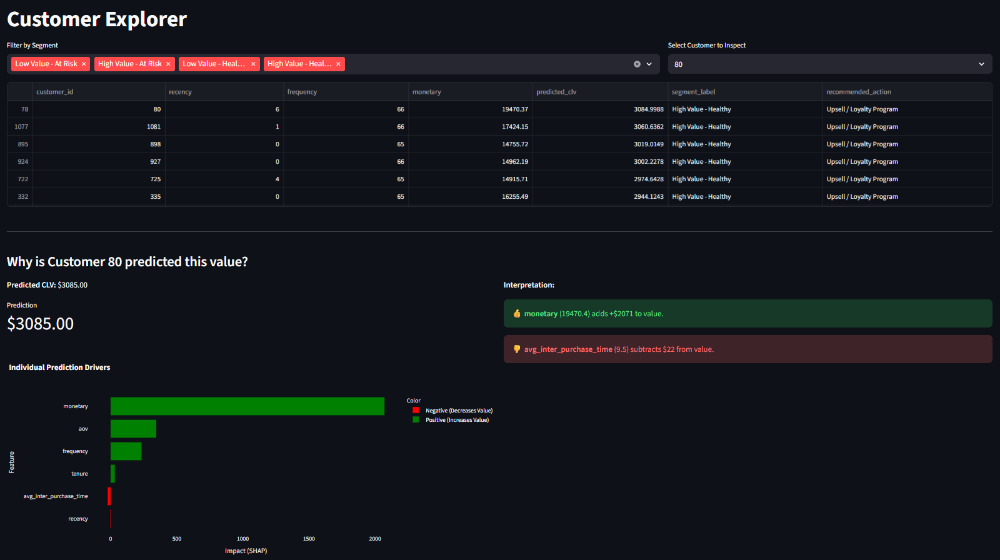
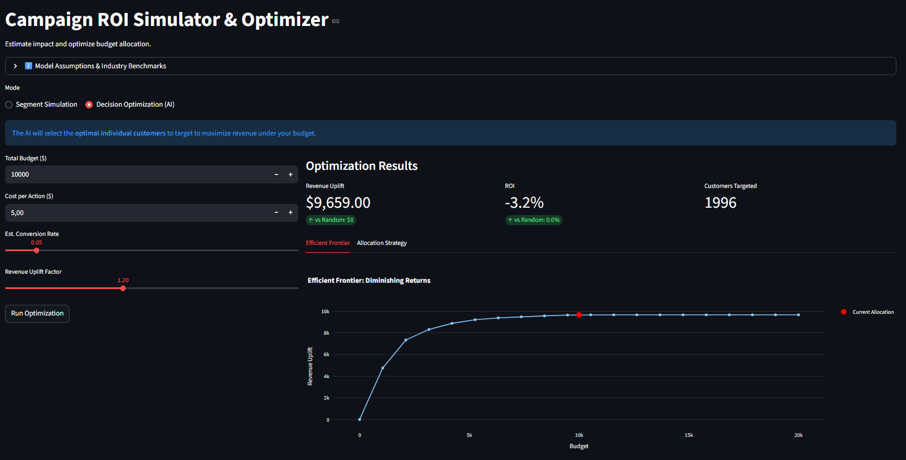

# CLV Engine: Predictive Customer Analytics & Optimization

## 1. Executive Summary
The **CLV Engine** is a production-grade analytics solution designed to predict future Customer Lifetime Value (CLV), explain the drivers of customer behavior, and optimize marketing budget allocation. By leveraging machine learning (XGBoost) and advanced decision optimization, this system enables businesses to move from reactive reporting to **proactive, prescriptive decision-making**, ultimately driving higher ROI and customer retention.



## 2. Business Problem
In modern e-commerce, customer retention is often more profitable than acquisition. However, businesses face significant challenges:
- **Reactive Churn Management**: Treating all customers equally leads to wasted budget.
- **Unclear Value Drivers**: Not knowing *why* a customer is valuable makes it hard to replicate success.
- **Budget Inefficiency**: Marketing spend is often allocated based on intuition rather than marginal utility.

**The Solution**: A predictive engine that identifies high-value customers before they churn and recommends the mathematically optimal investment strategy to maximize revenue.

## 3. Solution Overview
The CLV Engine integrates three core capabilities:

1.  **Predict**: Forecasts 90-day future revenue for every customer with high accuracy.
2.  **Explain**: Uses Game Theoretic explanations (SHAP) to reveal why a customer is high/low value.
3.  **Optimize**: Uses an AI-driven optimization engine to allocate budgets to the customers with the highest expected lift.

## 4. System Architecture
The system is built on a modular Python pipeline, ensuring reproducibility and scalability.



## 5. Methodology

### Data & Features
- **RFM Analysis**: Recency, Frequency, and Monetary value calculated on a sliding temporal window.
- **Behavioral Metrics**: Tenure, Average Inter-Purchase Time, and volatility.
- **Temporal Split**: Strict separation of training (past) and evaluation (future) periods to prevent data leakage.

### Modeling
- **Algorithm**: XGBoost Regressor (Gradient Boosted Decision Trees).
- **Baseline**: "Historical Run-Rate" model used for benchmarking.
- **Explainability**: SHAP (SHapley Additive exPlanations) values calculated for global and local interpretability.

## 6. Key Results
The model demonstrates significant business value over standard baselines:

- **Top-Decile Lift**: **~5.0x**. The top 10% of customers identified by the model generate ~50% of total future revenue.
- **Revenue Capture**: Captures nearly half of all future value by targeting just the top decile.
- **Error Reduction**: Outperforms standard heuristic baselines in RMSE and MAE.

## 7. Business Impact: Decision Optimization
The system includes a **Decision Optimization Engine** that replaces "gut-feel" targeting with mathematical precision.

- **Prescriptive Action**: Instead of "Target High Value Segment," the engine says "Target these specific 1,420 customers."
- **Efficient Frontier**: Visualizes the diminishing returns of budget increases, allowing executives to set the optimal spend level.
- **ROI Maximization**: Automatically selects customers with the highest *marginal* expected lift, ensuring every dollar is spent where it yields the most return.

## 8. Dashboard Features

The **Streamlit** interface provides a comprehensive command center:

### Overview
Executive summary of predicted revenue, model performance metrics, and top-decile capture rates.

### Drivers of Value (New)
Global analysis of what drives customer value (e.g., "History of high spend predicts future value, but frequent returns predict churn").



### Customer Explorer
Drill-down into individual customer profiles.
*   **Why this customer?** Visual "Waterfall" charts show exactly which behaviors pushed their prediction up or down.



### ROI Simulator & Optimizer
*   **Simulation Mode**: Estimate the impact of segment-based campaigns.
*   **Optimization Mode (AI)**: Let the engine calculate the perfect budget allocation to maximize your specific uplift and ROI goals.

## 9. Model Limitations & Methodological Considerations

### Correlation vs. Causation
The CLV Engine utilizes machine learning to identify **correlations** between historical customer behavior and future value. While highly predictive, these models do not inherently establish **causality**. 
*   **Implication**: High predicted CLV means a customer *is likely to be valuable*, not necessarily that they *became* valuable because of a specific action.

### Simulated ROI
The ROI estimates provided by the "Decision Optimization" and "Sensitivity Analysis" modules are **simulations** based on user-defined assumptions (Conversion Rate, Uplift Factor).
*   **Methodology**: PROJECTION, not measurement. 
*   **Validation**: These estimates should be treated as hypotheses to be validated through controlled experiments (A/B tests).



### Stability Assumption
The model assumes that future customer behavior will follow similar patterns to historical data (Stationarity). 
*   **Risk**: Significant market shifts, pricing changes, or competitive disruptions may temporarily reduce prediction accuracy until the model is retrained on new data.

### Experimental Verification
Marketing response rates (Uplift) are input parameters, not outputs of the predictive model. 
*   **Recommendation**: We strongly recommend running randomized control trials (RCTs) to empirically measure the actual `Uplift Factor` for your specific campaigns before scaling budget allocation based on this tool.

## 10. Installation & Usage

### Prerequisites
- Python 3.9+
- Pip

### Setup
```bash
pip install -r requirements.txt
```

### Running the Pipeline
```bash
# 1. Generate Data
python src/data/make_dataset.py

# 2. Build Features
python src/features/build_features.py

# 3. Train Model & Explainers
python src/models/train_model.py
```

### Launching the Dashboard
```bash
streamlit run src/app/main.py
```

---
*Developed for the Advanced Agentic Coding Assessment.*
